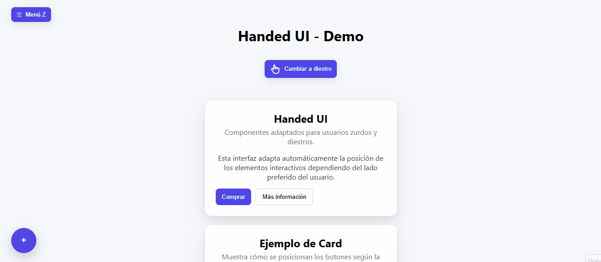
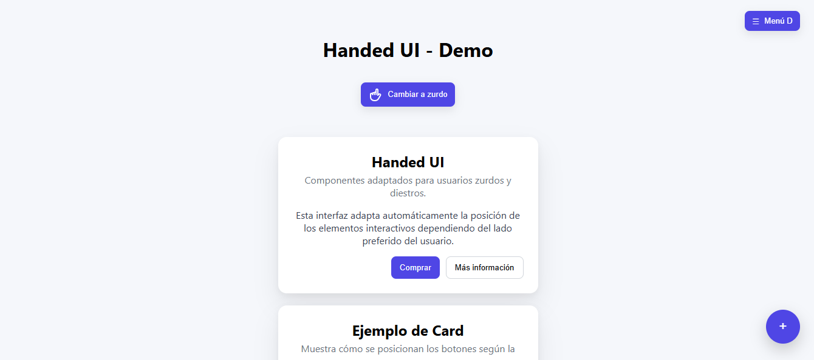
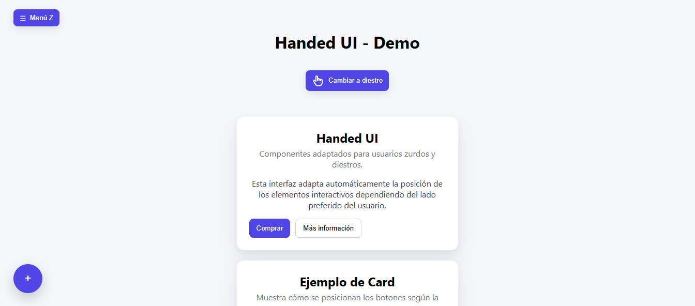

# Handed UI

> Adaptive React UI for left- and right-handed users.


[](https://handed-ui-demo.netlify.app/)

Biblioteca de componentes de interfaz para React que adapta la posición de elementos interactivos según la mano dominante del usuario (diestro o zurdo).

El objetivo es mejorar la experiencia de usuario y la accesibilidad, especialmente en interfaces móviles, moviendo automáticamente botones y acciones hacia el lado más cómodo para el usuario.

## ¿Por qué Handed UI?

Muchas interfaces móviles están diseñadas pensando en usuarios diestros.

Sin embargo, aproximadamente el **10% de la población es zurda**, y además muchas personas utilizan el teléfono con una sola mano.

Handed UI permite adaptar automáticamente la posición de elementos interactivos según la mano dominante del usuario, mejorando:

- la ergonomía
- la accesibilidad
- la experiencia de uso en dispositivos móviles

## Demo en vivo

https://handed-ui-demo.netlify.app/

## Demo

<p align="center">
  
</p>

## Capturas de pantalla

  


## Características

✋ Selector de mano dominante (diestro / zurdo)

🪝 Hook `useHand` para control total del estado

📱 Pensado para UX móvil

🧭 Adaptación automática del layout

🔘 Floating Action Button (FAB) adaptativo

📦 Componentes reutilizables en React

⚡ Ligero y fácil de integrar

## Instalación

```bash
npm install handed-ui
```

```bash
pnpm add handed-ui
```

```bash
yarn add handed-ui
```

## 🚀 Quick start

### Uso básico

### 1. Envolver la aplicación

```jsx
import { HandProvider } from "handed-ui";

function Root() {
  return (
    <HandProvider>
      <App />
    </HandProvider>
  );
}
```

### 2. Usar el hook

```jsx
import { useHand } from "handed-ui";

function Example() {
  const { hand, toggle, setHand } = useHand();

  return (
    <>
      <p>Mano actual: {hand}</p>
      <button onClick={toggle}>Cambiar</button>
    </>
  );
}
```

### 📦 Retorno del hook

```typescript
  {
    hand: "left" | "right";
    setHand: (hand: "left" | "right") => void;
    toggle: () => void;
  }

```

> ⚠️ `useHand()` devuelve un objeto. Es necesario desestructurarlo antes de renderizar.

## 🧩 Componentes

### HandProvider

Provee el contexto global que almacena la mano dominante seleccionada.

```jsx
<HandProvider>
  <App />
</HandProvider>
```

### HandToggle

Componente que permite cambiar entre modo diestro y zurdo.

```jsx
import { HandToggle } from "handed-ui";

<HandToggle />;
```

### Fab

Botón flotante que se posiciona automáticamente según la mano seleccionada.

```jsx
import { Fab } from "handed-ui";

<Fab onClick={() => console.log("click")} />;
```

## Cómo funciona

La librería utiliza un atributo en el elemento raíz:

```html
data-hand="right" data-hand="left"
```

Luego el CSS adapta el layout automáticamente.

Ejemplo:

```css
[data-hand="right"] .fab {
  right: 20px;
}

[data-hand="left"] .fab {
  left: 20px;
}
```

Esto permite adaptar la interfaz sin necesidad de lógica compleja en cada componente.

## Desarrollo local

Clonar el repositorio:

```bash
git clone https://github.com/Diego-Mostro-Dev/handed-ui.git
cd handed-ui

```

Instalá las dependencias:

```bash
npm install
```

Ejecutá la demo en desarrollo:

```bash
npm run dev
```

Abre http://localhost:3000 en tu navegador

## Estructura del proyecto

```
handed-ui
├─ src
│  ├─ components
│  ├─ context
│  └─ styles
├─ dist
├─ demo
└─ vite.config.js
```

## Personalización

Los estilos pueden sobrescribirse fácilmente mediante CSS.
Los botones toggle y otros componentes usan clases CSS que permiten tanto su estilo base como la adaptación automática según la mano:

.toggle → Clase base de todos los toggles. Define estilos generales (color, padding, borde, sombra, flex).

.hand-start → Aplica al botón de selección de mano debajo del título.

.hand-end → Aplica al toggle flotante tipo menú. Posición fija y lado según [data-hand="right"] o [data-hand="left"].

.card-actions → Contenedor de botones dentro de las cards.

.hand-flex-start y .hand-flex-end → Alinean los botones según la mano seleccionada (start o end).

Ejemplo:

```CSS
.fab {
background: black;
border-radius: 50%;
}
```

También puede integrarse con:

CSS Modules

Styled Components

Tailwind

## Tecnologías

React

CSS moderno (Flexbox)

Context API para manejo de la mano preferida (HandProvider)

Componente FAB flotante

**Autor:** Diego Salvado

**Repositorio:** https://github.com/Diego-Mostro-Dev/handed-ui

**LinkedIn:** [linkedin.com/in/diego-salvado](https://www.linkedin.com/in/diegosalvadodev/)

## Licencia

MIT License
Libre para uso personal y comercial.
